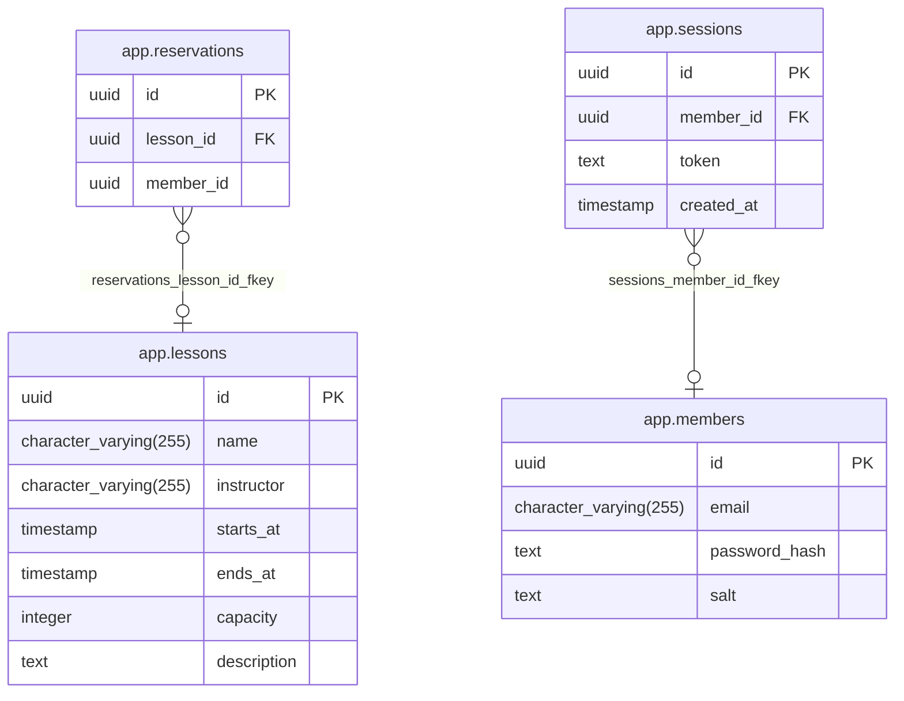

```mermaid
erDiagram
    app_lessons["app.lessons"] {
      uuid id PK
      character_varying(255) name
      character_varying(255) instructor
      timestamp starts_at
      timestamp ends_at
      integer capacity
      text description
    }
    app_members["app.members"] {
      uuid id PK
      character_varying(255) email
      text password_hash
      text salt
    }
    app_reservations["app.reservations"] {
      uuid id PK
      uuid lesson_id FK
      uuid member_id
    }
    app_reservations }o--o| app_lessons : reservations_lesson_id_fkey
    app_sessions["app.sessions"] {
      uuid id PK
      uuid member_id FK
      text token
      timestamp created_at
    }
    app_sessions }o--o| app_members : sessions_member_id_fkey
```
